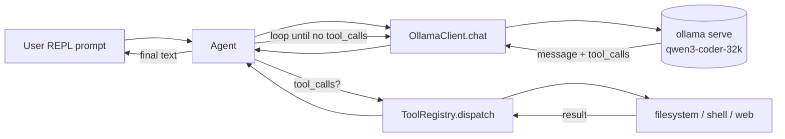

# Ollama Harness — Design

**Date:** 2026-05-20
**Status:** Approved, pending implementation plan
**Owner:** Eric Staples

## Goal

A small Python harness for experimenting with local LLMs served by Ollama. The harness exposes a fixed set of tools (filesystem, shell, web search) to the model via Ollama's native tool-calling API and provides an interactive REPL for conversational use.

Primary target model: `qwen3-coder-32k:latest` (a custom Modelfile derived from `qwen3-coder:30b` with `num_ctx=32768` and `temperature=0.7`).

## Non-goals

- No production agent framework. This is a learning/playground harness.
- No LangChain, LlamaIndex, or other heavyweight abstractions.
- No multi-model routing, no MCP, no remote API providers.
- No prompt-engineered ReAct fallback (Ollama native tool-calling only).
- No GUI or web interface.

## Architecture

A single-process REPL that runs a tool-calling loop against an Ollama server.



The agent owns the message history list, calls the Ollama client, inspects each response for `tool_calls`, dispatches calls through the registry, appends results as `role: "tool"` messages, and repeats until a response returns no tool calls. That final assistant text is streamed to the user.

## Components

```
ollama-experiments/
├── pyproject.toml          # uv-managed
├── harness/
│   ├── __main__.py         # `python -m harness` entry
│   ├── agent.py            # chat loop, tool dispatch, message history
│   ├── ollama_client.py    # thin wrapper around ollama-python
│   ├── config.py           # model name, temp, num_ctx, workspace path
│   ├── registry.py         # @tool decorator + JSON schema generation
│   └── tools/
│       ├── filesystem.py   # list_directory, read_file, write_file
│       ├── shell.py        # run_shell (workspace-rooted)
│       └── web.py          # search_web (DuckDuckGo via ddgs)
├── tests/
│   ├── test_registry.py
│   ├── test_tools_filesystem.py
│   ├── test_tools_shell.py
│   └── test_e2e.py         # gated by OLLAMA_E2E=1
├── workspace/              # sandbox root for tool ops (gitignored)
├── docs/superpowers/specs/ # design docs (this file)
└── README.md
```

| Module | Responsibility | Public surface |
|---|---|---|
| `harness/config.py` | Load config from env + CLI flags. Resolves `WORKSPACE_ROOT`. | `Config.from_env()` |
| `harness/ollama_client.py` | Thin wrapper around `ollama.Client.chat()`. Streaming + tool schema marshaling. | `OllamaClient.chat(messages, tools)` |
| `harness/registry.py` | `@tool` decorator: introspects type hints + docstring, emits Ollama tool JSON schema. Stores callables by name. | `@tool`, `ToolRegistry.schemas()`, `ToolRegistry.dispatch(name, args)` |
| `harness/tools/filesystem.py` | `list_directory`, `read_file`, `write_file` — all path-sandboxed. | three `@tool`-decorated functions |
| `harness/tools/shell.py` | `run_shell` with `cwd=workspace`, `env={}`, 30s timeout. | one `@tool` function |
| `harness/tools/web.py` | `search_web` via `ddgs` package, returns top-N results. | one `@tool` function |
| `harness/agent.py` | REPL + agent loop. Built-in commands: `/help`, `/reset`, `/quit`, `/history`, `/tokens`. | `run(config)` |
| `harness/__main__.py` | Entry point. Parses argv, builds Config, starts agent. | n/a |

### Tool registry

The `@tool` decorator reads a function's signature via `inspect.signature` and `typing.get_type_hints`, plus the first paragraph of its docstring, and produces the JSON schema Ollama expects in `tools[].function`. Adding a new tool is a typed function with a docstring — nothing else.

Supported parameter types in v1: `str`, `int`, `float`, `bool`, `list[str]`, `Optional[T]`. Anything else raises at registration time.

### Tools

| Tool | Signature | Behavior |
|---|---|---|
| `list_directory` | `(path: str = ".", glob: str \| None = None) -> list[str]` | Workspace-relative path; returns sorted filenames. |
| `read_file` | `(path: str, max_bytes: int = 100_000) -> str` | UTF-8 with `errors="replace"`. Truncates above `max_bytes` with explicit marker. |
| `write_file` | `(path: str, content: str, append: bool = False) -> dict` | Creates parent dirs inside workspace. Returns `{"path": ..., "bytes_written": N}`. |
| `run_shell` | `(command: str, timeout_sec: int = 30) -> dict` | `subprocess.run(["bash", "-c", command], cwd=workspace, env={"PATH": ..., "HOME": workspace}, timeout=...)`. Returns `{"exit_code": N, "stdout": "...", "stderr": "...", "timed_out": bool}`. |
| `search_web` | `(query: str, max_results: int = 5) -> list[dict]` | DuckDuckGo via `ddgs`. Each result: `{"title", "url", "snippet"}`. |

## Sandboxing

All filesystem and shell operations are confined to `WORKSPACE_ROOT` (default `./workspace`).

Path resolution rule:

```python
def resolve_in_workspace(path: str, workspace: Path) -> Path:
    resolved = (workspace / path).resolve()
    if not resolved.is_relative_to(workspace):
        raise ValueError(f"path escapes workspace: {path}")
    return resolved
```

This catches `../../etc/passwd`, absolute paths, and symlink escapes because `.resolve()` follows symlinks before the relative check.

Shell sandboxing:

- `cwd=workspace`
- `env={"PATH": "/usr/local/bin:/usr/bin:/bin", "HOME": str(workspace), "USER": os.environ.get("USER", "harness")}`
- 30s default timeout, hard-killed on overrun
- No interactive prompts: tools trust the sandbox

## Data flow — one turn

1. User input → `{"role": "user", "content": "..."}` appended to history.
2. `OllamaClient.chat(messages=history, tools=registry.schemas(), stream=True)`.
3. Stream collected. Tokens written directly to stdout as they arrive (no Markdown re-rendering during stream — keeps things simple and avoids fighting `rich.live`). After the turn completes, append full text to history. `rich` is used for static elements only: prompt prefix, tool-call trace lines, error banners, `/help` and `/history` output.
4. If `message.tool_calls` is non-empty:
   - For each call:
     - Print dim line: `▶ tool_name(args)`
     - `registry.dispatch(name, args)` → result
     - Print dim line: `◀ result (truncated to 500 chars on screen, full result kept in history)`
     - Append `{"role": "tool", "content": json.dumps(result), "tool_call_id": call.id, "name": call.function.name}`
   - Loop back to step 2 (no new user input).
5. Else: prompt user again.

Hard cap: `MAX_TOOL_ITERATIONS = 10` per user turn. On overrun, inject a system note "max tool iterations reached, please summarize what you found", call once more, return final text.

## Error handling

| Failure | Behavior |
|---|---|
| Ollama unreachable at startup | Friendly message, suggest `ollama serve`, exit 1 |
| Tool raises Python exception | Caught in registry, returned to model as `{"error": "<message>"}` |
| Path escapes workspace | Returned as `{"error": "path outside workspace"}` (not raised) |
| Shell timeout | Kill, return `{"exit_code": -1, "stdout": "...", "stderr": "...", "timed_out": true}` |
| Unknown tool name | Returned as `{"error": "no such tool: <name>"}` |
| Ctrl-C mid-stream | Cancel current turn, retain history, return to prompt |
| Max iterations hit | Inject summarize directive, one more call, finish turn |

**Principle: tool errors are data, not exceptions.** The model gets a chance to recover. Only fatal infrastructure (Ollama down) bubbles up to the user.

## Configuration

| Setting | Default | Source |
|---|---|---|
| `OLLAMA_HOST` | `http://localhost:11434` | env |
| `OLLAMA_MODEL` | `qwen3-coder-32k:latest` | env / `--model` |
| `TEMPERATURE` | `0.7` | env / `--temp` |
| `NUM_CTX` | `32768` | env / `--ctx` |
| `WORKSPACE_ROOT` | `./workspace` | env / `--workspace` |
| `MAX_TOOL_ITERATIONS` | `10` | env |
| `SHELL_TIMEOUT_SEC` | `30` | env |

Note: `num_ctx` and `temperature` are also baked into the `qwen3-coder-32k` Modelfile. Ollama's request-level options override Modelfile defaults, so the harness's settings act as live overrides when experimenting.

## Built-in REPL commands

| Command | Effect |
|---|---|
| `/help` | List commands and current config |
| `/reset` | Clear conversation history |
| `/quit` (or Ctrl-D) | Exit |
| `/history` | Pretty-print message history |
| `/tokens` | Print approximate token count of history (chars / 4 heuristic, v1) |

## Testing

| File | Coverage |
|---|---|
| `tests/test_registry.py` | `@tool` schema generation for str/int/float/bool/list/Optional types; unsupported types raise at registration |
| `tests/test_tools_filesystem.py` | Sandbox escape attempts (absolute paths, `..`, symlinks) return errors; happy paths work; uses `tmp_path` as workspace |
| `tests/test_tools_shell.py` | Timeout enforced, cwd is workspace, output captured, exit code propagated |
| `tests/test_e2e.py` | Gated by `OLLAMA_E2E=1`. Single round-trip against live Ollama validating tool call format. Skipped by default. |

Run with `uv run pytest`.

## Dependencies

| Package | Purpose |
|---|---|
| `ollama` | Official Ollama Python SDK |
| `ddgs` | DuckDuckGo search, no API key required |
| `rich` | REPL coloring, spinner, Markdown rendering |
| `pytest` (dev) | Tests |
| `pytest-mock` (dev) | Mocking in tests |

Python `>=3.11` for `Path.is_relative_to` and modern typing.

## Open questions / future work

These are deliberately deferred — not part of v1:

- Persisting conversation history across REPL sessions (`/save`, `/load`).
- Multi-model A/B (split-screen runs of two models on the same prompt).
- Optional prompt-engineered ReAct mode for educational comparison.
- Streaming tool result rendering (currently buffered).
- Token counting via actual tokenizer rather than chars/4 heuristic.
- MCP client support.
